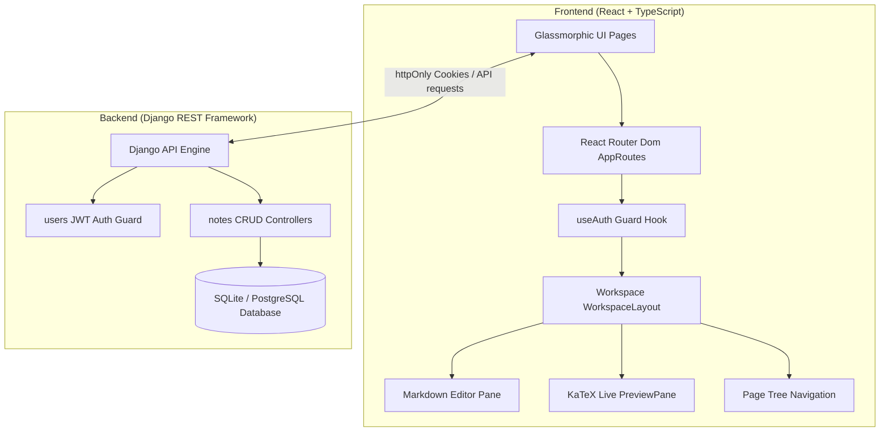

# Notion Lite — Next-Gen Markdown Workspace 📝🚀

Notion Lite is a high-fidelity, responsive single-file compiler workspace designed to combine the raw efficiency of Markdown with the polished interactive components of modern document editors. Built with a responsive glassmorphic design system, it features nested workspace organization, custom HSL tag badges, quick-actions omnibars, and browser-native watermark-free PDF generation.

---

## 🌟 Key Features

- **Hierarchical Nested Tree Routing:** Nest files and folders infinitely to keep documentation, project roadmaps, and guidelines clean.
- **Notion-Style Slash (`/`) Commands:** Trigger a basic block popup menu in the editor to quickly create headers, checklists, code blocks, or math formulas.
- **LaTeX Mathematical Compilation:** Renders inline and block-level formulas in real time with sub-5ms latency using **KaTeX**.
- **Interactive Omnibar Search:** Launch with `Ctrl+K` / `Cmd+K` to search titles, tag badges, or document body text with regex highlight matching.
- **Vibrant Tags Manager:** Configure HSL color presets for tags, assign them to page headers, and query notes dynamically in milliseconds.
- **Offline-First Tree Syncing:** Tree structures, node changes, and drafts are cached locally in browser storage, syncing automatically on server reconnection.
- **Smart PDF Exporting:** Compiles active markdown layouts into standard print-ready styling templates for watermark-free client side PDF generation.
- **Secure httpOnly Auth Guards:** Protects user routes, profiles, and backend endpoints using secure httpOnly JWT cookies to resist XSS.

---

## 🏗️ Architecture



---

## ⚙️ Project Setup

### Prerequisites
- **Node.js** (v18+)
- **Python** (3.10+)

---

### 1. Backend Setup (Django)

1. Navigate to the backend directory:
   ```bash
   cd backend
   ```
2. Create and activate a virtual environment:
   ```bash
   python -m venv venv
   # On Windows:
   .\venv\Scripts\activate
   # On macOS/Linux:
   source venv/bin/activate
   ```
3. Install dependencies:
   ```bash
   pip install -r requirements.txt
   ```
4. Configure your `.env` variables (use `.env.example` as a template):
   ```bash
   cp .env.example .env
   ```
5. Apply migrations and seed database:
   ```bash
   python manage.py migrate
   ```
6. Run the local development server:
   ```bash
   python manage.py runserver
   ```

---

### 2. Frontend Setup (React)

1. Navigate to the frontend directory:
   ```bash
   cd ../frontend
   ```
2. Install dependencies:
   ```bash
   npm install
   ```
3. Run the development environment:
   ```bash
   npm run dev
   ```

---

## 🐋 Running with Docker

You can launch the entire stack (Frontend + Backend + DB) seamlessly using Docker Compose:

1. Ensure Docker is running.
2. In the project root, run:
   ```bash
   docker-compose up --build
   ```
3. Open `http://localhost:5173` to explore the workspace.

---

## 🧪 Testing

### Backend Unit Tests (pytest)
Navigate to `backend/` and run:
```bash
pytest
```

### Frontend Unit Tests (Vitest)
Navigate to `frontend/` and run:
```bash
npx vitest run
```
